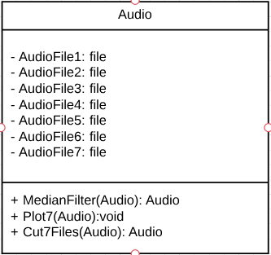
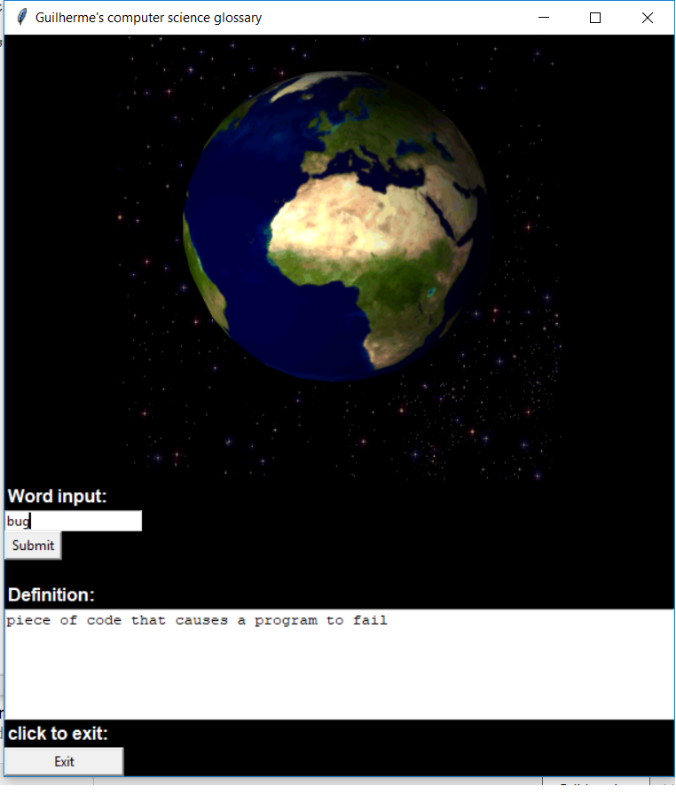

# guilherme_EstimacaodeDoA

## Descrição
A base deste vem do projeto que tenho desenvolvido na iniciação científica, com o professor Apolinário. A motivação vem de um projeto maior, que foi uma demanda da Emgepron, consistindo na estimação da direção de chegada (ou DoA, direction of arrival) de tiros a partir de amostras de áudio coletadas por um arranjo espacial de microfones. A proposta seria um programa em Python que lê arquivos de áudio (cada arquivo referente a um tiro), aplica o median filter  (ou não, ficando a critério do usuário) e recorta o intervalo de interesse (o que contém o disparo). Esse programa facilita as medições das diferenças de tempo entre as amostras para, depois de alguns recursos matemáticos envolvendo FFT (Fast Fourier Transform) e método dos mínimos quadrados, poder determinar a  DoA.

## Documentação

### Diagrama de Classes

### Fluxograma

### Tutorial Tkinter
O tutorial escolhido encontra-se no Youtube e refere-se à interface gráfica padrão do Python, o **Tkinter**. Link para acesso: https://www.youtube.com/watch?v=_lSNIrR1nZU&t=970s

### Esboço GUI

### Instalação e funcionamento

#### Instalando o Python
Primeiramente entre no site https://www.python.org/ , clique em Downloads e baixe a versão 3.6 (32 bit). Depois de feito o download, siga a sequência proposta, ao começar a instalação:
Customize Installation -> Deixar somente C:\Python36-32 (para facilitar quando for usar o prompt de comando)

#### Instalando as bibliotecas necessárias (Matplotlib, Scipy e FFmpeg)
Uma vez instalado, execute o prompt de comando como administrador (essa opção aparece ao se clicar com o botão direito do mause no app cmd). Em seguida execute os seguintes comandos para instalar Matplotlib e Scipy:
cd.. -> cd.. -> cd Python36-32 -> cd Scripts -> dir/w -> pip install matplotlib -> pip install scipy

FFmpeg: Faça o download no site https://ffmpeg.zeranoe.com/builds/ -> Descompacte o arquivo e modifique o nome para FFmpeg -> Copie a pasta e cole-a no disco local C -> Abra-a (no disco local), clique na pasta Bin e copie o atalho do endereço dessa pasta -> Na coluna esquerda, clique em This PC com o botão direito -> Propriedades -> Advanced System -> Settings -> Environment variables -> clique duas vezes em path -> new -> cola o endereço
Feito isso, abra o prompt de comando e digite: ffmpeg -version; depois digite ffmpeg -h (para conferir se instalou).

#### Fazendo o programa funcionar
Primeiramente, deve-se colocar na mesma pasta o aqruivo do programa e os arquivos de áudio. Para fazê-lo rodar, deve-se clicar nele com o botão direito e clicar em editar com IDLE. Após isso, deve-se alterar os endereços das linhas 107 a 113, 239 a 245 e 527 a 533, para o endereço da pasta em que foi salvo o arquivo do programa (lembrando que as barras a serem usadas não são as invertidas). Feito isso, salvar as alterações, clicar em run e em seguida em run module.

