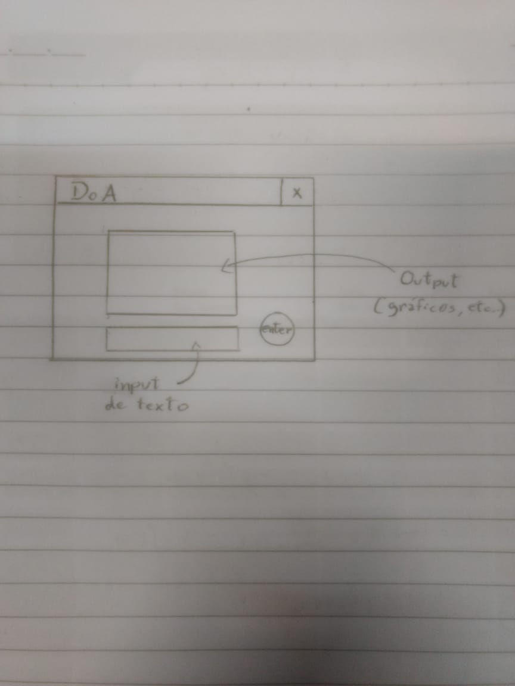

# guilherme_EstimacaodeDoA

## Descriçao
A base deste vem do projeto que tenho desenvolvido na iniciação científica, com o professor Apolinário. A motivação vem de um projeto maior, que foi uma demanda da Emgepron, consistindo na estimação da direção de chegada (ou DoA, direction of arrival) de tiros a partir de amostras de áudio coletadas por um arranjo espacial de microfones. A proposta seria um programa em Python que lê arquivos de áudio (cada arquivo referente a um tiro), aplica o median filter  (ou não, ficando a critério do usuário) e recorta o intervalo de interesse (o que contém o disparo). Esse programa facilita as medições das diferenças de tempo entre as amostras para, depois de alguns recursos matemáticos envolvendo FFT (Fast Fourier Transform) e método dos mínimos quadrados, poder determinar a  DoA.

## Documentação

### Diagrama de Classes

### Fluxograma

### Tutorial Tkinter
O tutorial escolhido encontra-se no Youtube e refere-se à interface gráfica padrão do Python, o **Tkinter**. Link para acesso: https://www.youtube.com/watch?v=_lSNIrR1nZU&t=970s

### Esboço GUI

